:toc: left
:source-highlighter: python-pygments

= Digital Image Processing
Samuel Amico <sam.fst@gmail.com>

An indroduction to http://asciidoc.org[AsciiDoc] and http://opencv.org[OpenCV].

== Pixel Manipulation
The objective of this lesson is to show how we can manipulate the pixels of an image, for that we can access a pixel value by it's row and column coordinates. For BGR image, it returns an array of Blue,Green,Red values.For grayscale image, just corresponding intensity is returned.

* Negative of a Region of Interest (ROI)
In this example we'll be selecting a ROI with a specific coordinates that we give inside the program. The next step is invert the ROI, for this we use the simple formula: pixel_color_new = 255 - pixel_color_old. The image are in the grayscale.

[.float-group]
--
[.left]
.Biel image
image::biel.png[Biel,300,300]

[.right]
.Negative image
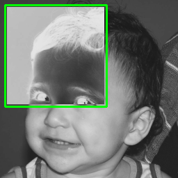 
--

[source,python,linenums]
----
include::trabalho1.py[]
----
 
* Swapping regions
In this example we'll divided the image in four quadrants (they have the same dimension) - ROI A,B,C,D. Where each ROI are built from a copy of the original image, cv2.copy(). A new image will be construct by using those ROI, swapping them in differents ways.

[.float-group]
--
[.left]
.Biel image
image::biel.png[Biel,300,300]

[.right]
.Swapping image
image::bielmix.png[Swapping,300,300] 
--

[source,python,linenums]
----
include::trabalho1-1.py[]
----

* Change color of a Region of Interest (ROI)
In this example we'll change a color from a ROI that we selected from the program. The ROI are change for White, Black and another color of interest.

[.float-group]
--
[.left]
.Bolhas image
image::bolhas.png[Bolhas,300,300]

[.left]
.BolhasWhite image
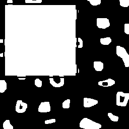

[.right]
.BolhasColor image
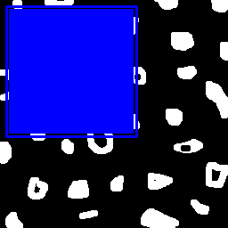

.BolhaBlack image
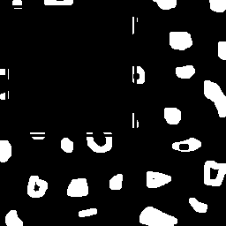
--

[source,python,linenums]
----
include::trabalho2.py[]
----

== Filling regions

* Labeling objects
The example illustrates the use of two functions: a) Count regions with and without hoeles, b) Fill holes. To do this, a special function called FloodFill() consists of finding a pixel(pixel of interest) and,from this, filling the adjacent regions in a color chosen by the user. The FloodFill function works like this: the function find the start pixel and works by running neighboring pixels and checking the BGR or gray intensity (and changes to the desired color).

But this algorithm does not work when the number of objects exceeds 255, for this a different number representation as such as floting point.   

[.float-group]
--
[.left]
.Bolhas image
image::bolhas.png[Bolhas,300,300]

[.left]
.BolhaAtualizada image
image::BolhaAtualizada.png[BolhasAtualizadas,300,300]

[.right]
.BolhaCheia image
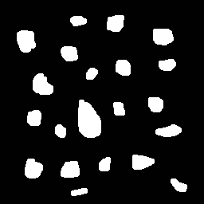

[.right]
.BolhaFuro image
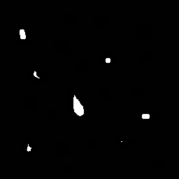

[.right]
.BolhaTotal image
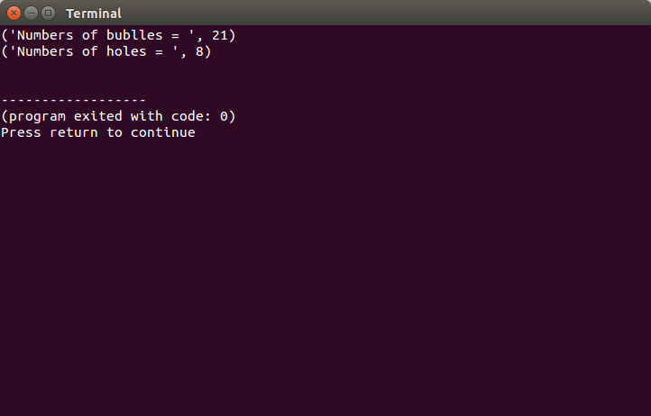
--

[source,python,linenums]
----
include::trabalho3.py[]
----

== Histogram
Histograms in digital images in grayscale,for example,usually associate a histogram with the occurrence count of each of the possible tones in an image. Roughly, the histogram gives an estimate of the probability of occurrence of gray tones in the image. In this example I'm using Histogram equalization, this method improves the contrast in an image, in order to stretch out the intesity range.

[.float-group]
--
[.left]
.HistEqualizado image
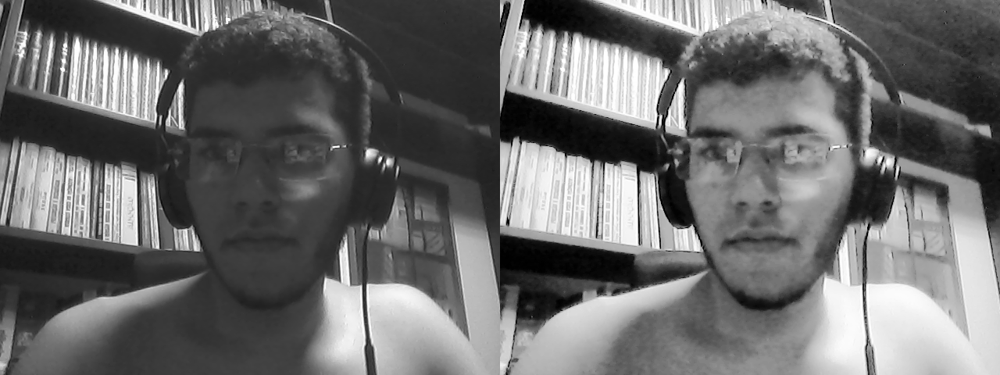
--

[source,python,linenums]
----
include::trabalho4.py[]
----

== Motion Detector
Continuing to use the idea of image histogram, in this example we'll detect if a moviment occurs in a ROI. The main idea of the code is based on the use of correlation between two frames of an video. However, we'll use only the Blue Channel on openCV (you can use the Red or Green) to use the  HistComparation and calcHist on the code.If the number comparation < 0, then movement is detected.

[.float-group]
--

[.left]
.Motion image
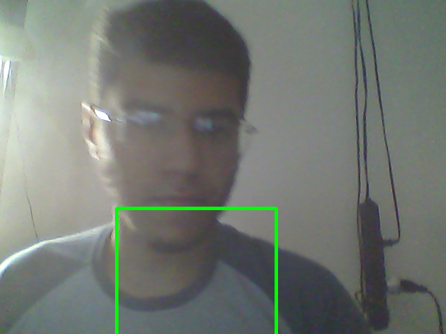

[.right]
.DectMotion image
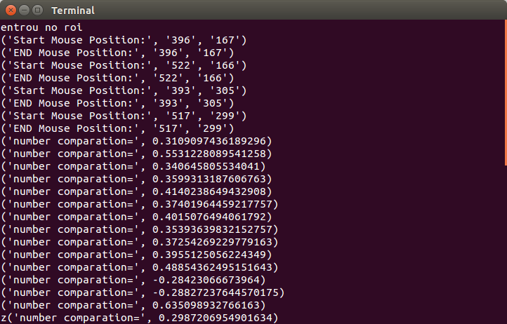

--

[source,python,linenums]
----
include::Hist_comp.py[]
----

== LapacianGauss Filter
In this simple example, we'll just use the different filters in the video capture.The main filter is the LaplacianGauss, this filter is composed of the sequence of the application of a Gaussian and Laplacian filter.

[.float-group]
--

[.left]
.ImgOrig image
image::ImgOrig.png[ImgOrig,800,700]

[.right]
.LaplaceGauss image
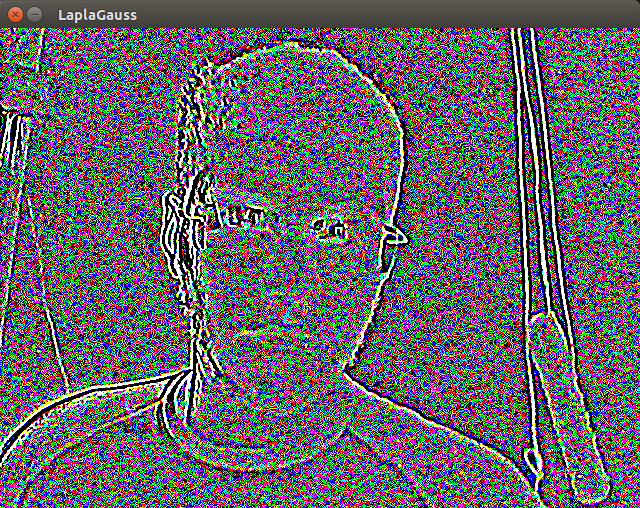

--

[source,python,linenums]
----
include::trabalho6.py[]
----

== Tilt-Shift
In this example we`ll simulate a photography technique called tilt-shift. The principle used to simulate the tilt-shift lens is to combine the original image with its low-pass filtered version, so as to produce in the vicinity of the edge the effect of the while maintaining the image without blurring in the center region.

[.float-group]
--

[.left]
.bara image
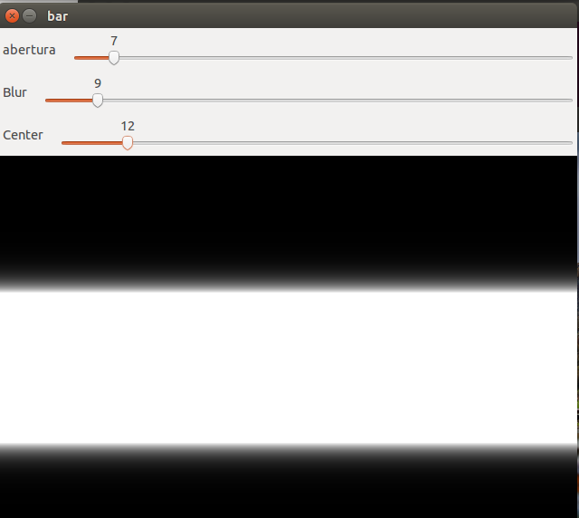

[.left]
.ImgCentral image
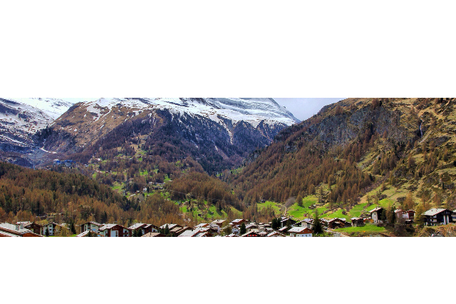

[.right]
.ImgOrig image
image::ImgOrig.png[ImgOrig,700,600]

[.right]
.Imglur image
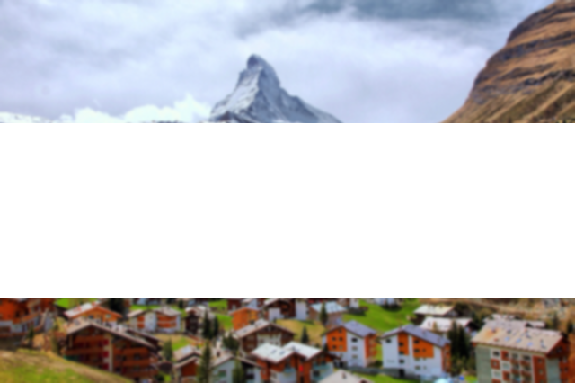

[.right]
.TiltShift image
image::TiltShift.png[TiltShift,700,600]

--

[source,python,linenums]
----
include::teste.py[]
----

